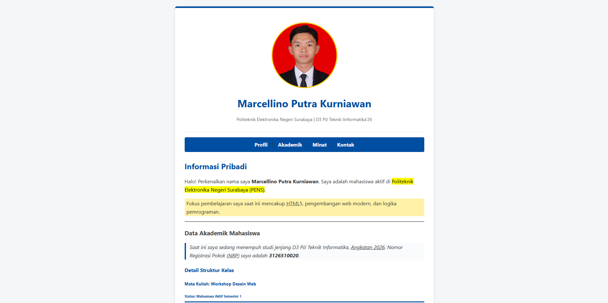

# Profil Diri | HTML Fundamentals

Sebuah proyek halaman web statis portofolio yang dikembangkan sebagai tugas praktikum **Modul 01: HTML Dasar** pada mata kuliah **Workshop Desain Web**. Proyek ini mendemonstrasikan implementasi kerangka dasar web menggunakan elemen semantik yang terstruktur, rapi, dan fungsional.

## 🚀 Fitur Utama

- **Struktur Semantik HTML5:** Penggunaan tag `<header>`, `<nav>`, `<main>`, `<section>`, `<aside>`, dan `<footer>` untuk aksesibilitas dan SEO yang lebih baik.
- **Hierarki Konten (Headings):** Penataan judul menggunakan `<h1>` hingga `<h6>` secara berurutan.
- **Pemformatan Teks Komprehensif:** Penerapan berbagai variasi tipografi seperti `<b>`, `<i>`, `<mark>`, ``, ``, hingga `<del>` dan `<ins>`.
- **Navigasi Internal:** Tautan _anchor_ (`href="#id"`) yang memungkinkan pengguna melompat ke bagian spesifik pada halaman (Profil, Akademik, Minat, Kontak).
- **Formulir Interaktif:** Simulasi form kontak menggunakan `<form>`, `<fieldset>`, `<input>`, `<textarea>`, dan `<button>`.
- **CSS Internal Styling:** Modifikasi antarmuka visual dasar langsung di dalam tag `<style>`, mencakup tata letak _container_, modifikasi warna korporat, _box-shadow_, dan tata letak gambar profil.

## 🛠️ Teknologi yang Digunakan

- **HTML5** (Struktur Utama)
- **CSS3** (Internal Styling)

## 📁 Struktur Navigasi Halaman

1. **Informasi Pribadi:** Perkenalan singkat dan fokus pembelajaran.
2. **Data Akademik:** Detail status mahasiswa dan program studi.
3. **Hobi dan Minat:** Daftar aktivitas menggunakan _unordered list_ (`<ul>`).
4. **Tautan Portofolio:** Tautan eksternal ke website pribadi dan GitHub.
5. **Kirim Pesan:** _Form_ sederhana untuk demonstrasi elemen input.

## 📸 Tangkapan Layar (Screenshot)

## 👨‍💻 Penulis

**Marcellino Putra Kurniawan**

- **NRP:** 3126510020
- **Program Studi:** D3 PJJ Teknik Informatika 26'
- **Institusi:** Politeknik Elektronika Negeri Surabaya

---

_Dibuat untuk memenuhi tugas praktikum 1 Workshop Desain Web (Semester 1)._
